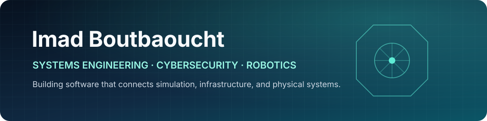

  

  
<strong>Engineering student at UM6P College of Computing</strong>

  
Building dependable systems across software, infrastructure, cybersecurity, simulation, and robotics.

  

    
    
  

## Current focus

- **ARCAD** — research platform for network-aware multi-UAV simulation using RotorPy, ROS 2, ns-3, Protobuf, and ZeroMQ.
- **PHANTOM** — autonomous ground-vehicle prototype developed through the Forgebots Robotics Club.
- **Cybersecurity** — web-security labs, Capture the Flag competitions, networking, and early bug-bounty practice.

## Selected work

| Project | Engineering focus | Main technologies |
|---|---|---|
| **[GitHop](https://github.com/IBoutbaoucht/GitHop)** | Full-stack discovery platform for GitHub activity, trends, and repositories | TypeScript, React, Node.js, PostgreSQL, BigQuery |
| **[VMaaS Zero-Touch](https://github.com/IBoutbaoucht/vmaas-zerotouch)** | Automated Ubuntu virtual-machine provisioning and lifecycle operations on VMware ESXi | Go, cloud-init, VMware ESXi |
| **[Iron Bird CTF](https://github.com/IBoutbaoucht/iron-bird-ctf)** | Fully authored eight-stage ESP32 security challenge with a custom UDP protocol and browser progression map | ESP32, C++, FreeRTOS, UDP, cryptography |
| **[Aero Simulator 2D](https://github.com/IBoutbaoucht/Aero-Simulator-2D)** | Modular flight simulator with birotor dynamics, Runge–Kutta integration, PID control, and live telemetry | Python, NumPy, Pygame |
| **[Information Security Labs](https://github.com/IBoutbaoucht/info-sec)** | Reproducible experiments covering web security and defensive analysis | Web security, Linux, Python |
| **[Bablo Fruits](https://github.com/IBoutbaoucht/blablo-fruits)** | Crop-condition recognition developed for the Local Domotics Competition | Python, YOLOv8, EfficientNet |

## Technical toolkit

**Programming:** `C++` `C` `Python` `Go` `TypeScript`  
**Systems and infrastructure:** `Linux` `Docker` `Nginx` `VMware ESXi`  
**Robotics and simulation:** `ROS 2` `ns-3` `MuJoCo` `ESP32` `FreeRTOS`  
**Backend and data:** `Node.js` `PostgreSQL` `GraphQL` `Google BigQuery`  
**Security:** `Burp Suite` `Nmap` `Web Security` `CTFs`

  Based in Morocco · Open to internships, remote work, and relocation

