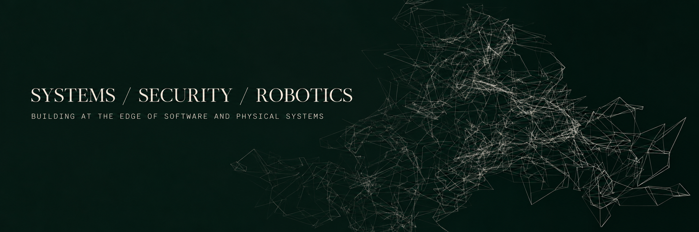

<div align="center">
  

  <p><code>ENGINEERING STUDENT // UM6P COLLEGE OF COMPUTING</code></p>
  <p>Building dependable systems across software, infrastructure, cybersecurity, simulation, and robotics.</p>

  <p>
    <a href="https://iboutbaoucht.github.io/"><strong>[ RESUME ]</strong></a>
    &nbsp;·&nbsp;
    <a href="https://www.linkedin.com/in/imad-boutbaoucht/"><strong>[ LINKEDIN ]</strong></a>
  </p>
</div>

---

## `/current`

```text
[01] ARCAD
     network-aware multi-UAV research simulation
     RotorPy / ROS 2 / ns-3 / Protobuf / ZeroMQ

[02] PHANTOM
     autonomous ground-vehicle prototype
     developed through the Forgebots Robotics Club

[03] SECURITY
     web-security labs / CTFs / networking
     early bug-bounty practice
```

> Curiosity first. Systems before surfaces. Evidence before claims.

<div align="center">
  <sub>Morocco · Open to internships, remote work, and relocation</sub>
</div>
