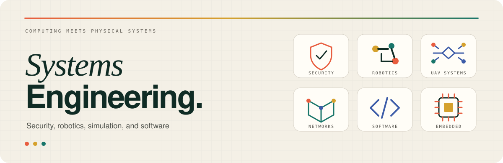
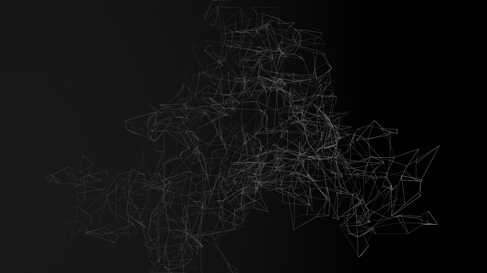

  

   

  

  <h3>Engineering student at UM6P College of Computing</h3>
  
Building dependable systems across software, infrastructure, cybersecurity, simulation, and robotics.

  

    <a href="https://iboutbaoucht.github.io/"><strong>[ RESUME ]</strong></a>
    &nbsp;·&nbsp;
    <a href="https://www.linkedin.com/in/imad-boutbaoucht/"><strong>[ LINKEDIN ]</strong></a>
  

---

## What I’m working on

- **ARCAD:** network-aware multi-UAV research simulation using RotorPy, ROS 2, ns-3, Protobuf, and ZeroMQ.
- **PHANTOM:** autonomous ground-vehicle prototype developed through the Forgebots Robotics Club.
- **Cybersecurity:** web-security labs, Capture the Flag competitions, networking, and early bug-bounty practice.

  Morocco · Open to internships, remote work, and relocation

