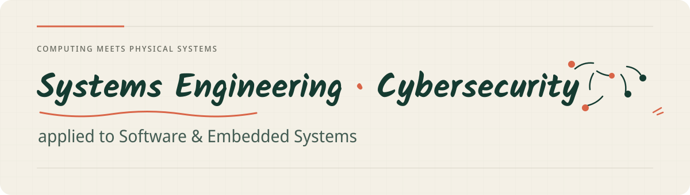

  

  <h3>Engineering student at UM6P College of Computing</h3>
  
Building dependable systems across software, infrastructure, cybersecurity, and simulation.

  

    
    
  

---

## What I'm working on

- **ARCAD** — research platform for network-aware multi-UAV simulation using RotorPy, ROS 2, ns-3, Protobuf, and ZeroMQ.
- **PHANTOM** — autonomous ground-vehicle prototype developed through the Forgebots Robotics Club.
- **Cybersecurity** — web-security labs, Capture the Flag competitions, networking, and early bug-bounty practice.

  Based in Morocco · Open to internships, remote work, and relocation

