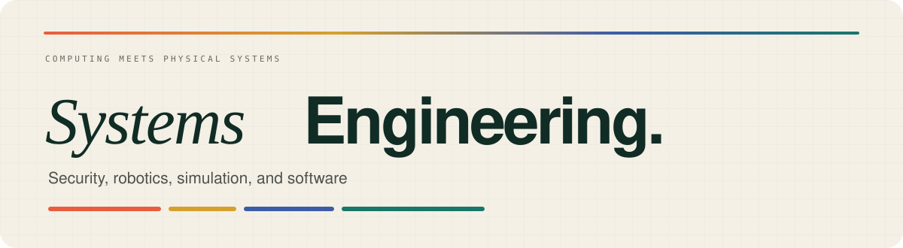

  

  <h3>Engineering student at UM6P College of Computing</h3>
  
Building dependable systems across software, infrastructure, cybersecurity, simulation, and robotics.

  

    <a href="https://iboutbaoucht.github.io/"><strong>[ RESUME ]</strong></a>
    &nbsp;·&nbsp;
    <a href="https://www.linkedin.com/in/imad-boutbaoucht/"><strong>[ LINKEDIN ]</strong></a>
  

---

## What I’m working on

<table>
  <tr>
    <td width="33%" valign="top">
      <strong>ARCAD</strong>  
      A network-aware multi-UAV research platform connecting flight simulation, robotics middleware, and communication modelling.  
      RotorPy · ROS 2 · ns-3 · Protobuf · ZeroMQ
    </td>
    <td width="33%" valign="top">
      <strong>PHANTOM</strong>  
      An autonomous ground-vehicle prototype in active development with the Forgebots Robotics Club.  
      Embedded systems · Vehicle control · Communication
    </td>
    <td width="33%" valign="top">
      <strong>CYBERSECURITY</strong>  
      Building practical web-security experience through PortSwigger labs, CTFs, networking, and bug-bounty study.  
      Web security · Burp Suite · Nmap · CTFs
    </td>
  </tr>
</table>

  Morocco · Open to internships, remote work, and relocation

